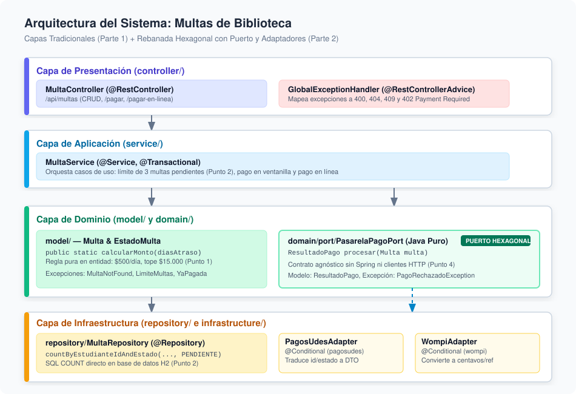
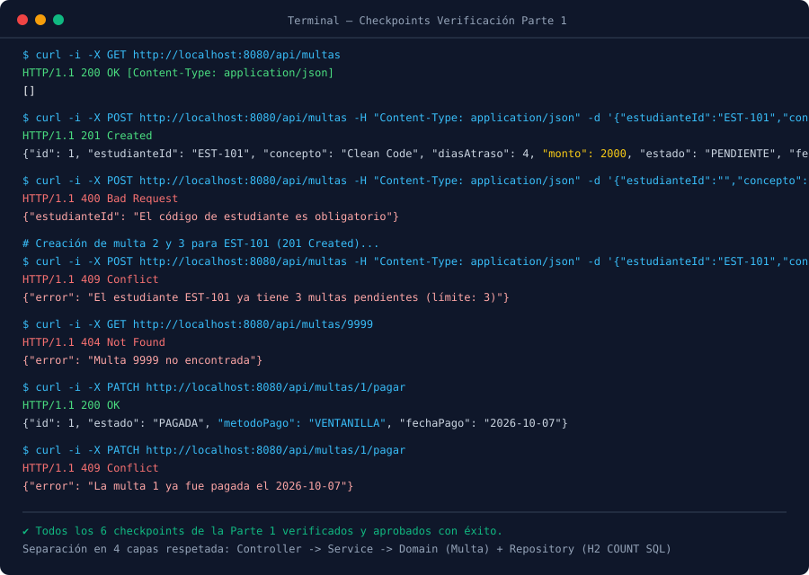
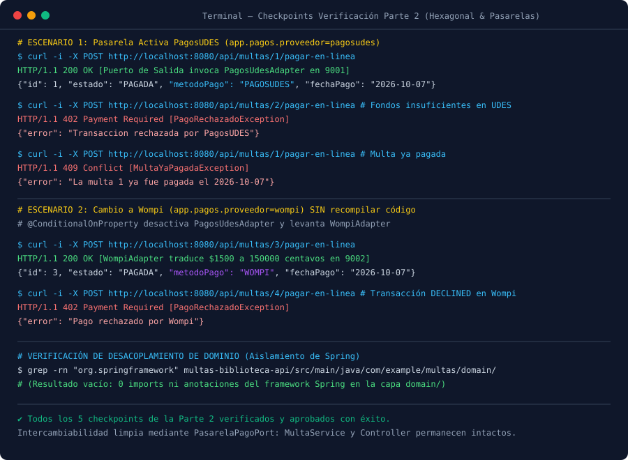

# Post-contenido — Unidad 7: Patrones Arquitectónicos I
### De Capas Simples a una Decisión Arquitectónica Justificada

**Estudiante:** Jhoseth Esneider Rozo Carrillo  
**Código:** 02230131027  
**Asignatura:** Patrones de Diseño de Software — Sexto Semestre  
**Universidad:** Universidad de Santander (UDES)  
**Repositorio GitHub:** [rozo-post1-u7](https://github.com/JhosethRozo/rozo-post1-u7)

---

## 1. Descripción del Proyecto
Este repositorio contiene el desarrollo del post-contenido de la Unidad 7 de Patrones de Diseño de Software. Se implementa un único proyecto Spring Boot (`multas-biblioteca-api`) para la gestión universitaria de multas de biblioteca por devolución tardía de material bibliográfico, estructurado en dos partes complementarias:

1. **Parte 1 — Arquitectura en Capas:** Construcción de una API REST completa organizada rigurosamente en capas de Presentación (`controller/`), Aplicación (`service/`), Dominio (`model/`) e Infraestructura (`repository/`) con persistencia en H2 en memoria, donde las reglas de negocio no triviales residen en sus capas correspondientes sin reducir el servicio a un mero passthrough.
2. **Parte 2 — Pago en Línea con Dos Pasarelas (Decisión Arquitectónica):** Incorporación del nuevo requisito de recaudación en línea soportando simultáneamente dos pasarelas de pago independientes e intercambiables por configuración institucional (**PagosUDES** y **Wompi**), implementando y justificando una rebanada de **Arquitectura Hexagonal (Puertos y Adaptadores)** en el subsistema de pagos.

---

## 2. Diagrama de Arquitectura y Estructura de Paquetes



### Árbol de Directorios del Repositorio
```
rozo-post1-u7/
├── .gitignore
├── README.md
├── docs/
│   ├── diagrama-arquitectura.svg
│   ├── captura-checkpoints-parte1.svg
│   ├── captura-checkpoints-parte2.svg
│   └── mock_pasarelas.py
└── multas-biblioteca-api/
    ├── pom.xml
    └── src/
        ├── main/
        │   ├── java/com/example/multas/
        │   │   ├── MultasApplication.java
        │   │   │
        │   │   ├── controller/                         [PRESENTACIÓN - Parte 1]
        │   │   │   ├── GenerarMultaRequest.java
        │   │   │   ├── GlobalExceptionHandler.java
        │   │   │   └── MultaController.java
        │   │   │
        │   │   ├── service/                            [APLICACIÓN - Parte 1 y 2]
        │   │   │   └── MultaService.java
        │   │   │
        │   │   ├── model/                              [DOMINIO BASE - Parte 1]
        │   │   │   ├── EstadoMulta.java
        │   │   │   ├── LimiteMultasPendientesException.java
        │   │   │   ├── Multa.java
        │   │   │   ├── MultaNotFoundException.java
        │   │   │   └── MultaYaPagadaException.java
        │   │   │
        │   │   ├── repository/                         [INFRAESTRUCTURA BD - Parte 1]
        │   │   │   └── MultaRepository.java
        │   │   │
        │   │   ├── domain/                             [DOMINIO HEXAGONAL - Parte 2]
        │   │   │   ├── PagoRechazadoException.java
        │   │   │   ├── ResultadoPago.java
        │   │   │   └── port/
        │   │   │       └── PasarelaPagoPort.java
        │   │   │
        │   │   └── infrastructure/                     [INFRAESTRUCTURA ADAPTADORES - Parte 2]
        │   │       ├── config/
        │   │       │   └── RestTemplateConfig.java
        │   │       └── pago/
        │   │           ├── PagosUdesAdapter.java
        │   │           └── WompiAdapter.java
        │   │
        │   └── resources/
        │       └── application.properties
        │
        └── test/
            └── java/com/example/multas/
                ├── MultasApplicationTests.java         [Tests Integración Parte 1]
                └── PagoEnLineaParte2Tests.java         [Tests Hexagonal y Adaptadores Parte 2]
```

---

## 3. Decisiones de Diseño

### Punto de Decisión 1 — Cálculo del monto: ¿Entidad o Service?
- **Decisión adoptada:** La fórmula para liquidar el monto de la multa (`días de retraso * $500 COP`, con un tope máximo de `$15.000 COP`) se implementó como un método estático puro dentro de la propia entidad de dominio: `Multa.calcularMonto(int diasAtraso)`.
- **Criterio técnico de selección:** Si una regla de negocio no requiere de ningún colaborador externo (no necesita consultar la base de datos vía `Repository`, ni llamar clientes HTTP, ni invocar servicios complementarios) y opera estrictamente sobre datos atómicos propios del dominio, **debe vivir dentro del objeto de dominio**.
- **Justificación frente a la alternativa descartada:** Ubicar este cálculo como un método privado o de utilidad en `MultaService` degrada a `Multa` a un contenedor pasivo de datos (antipatrón de **Modelo de Dominio Anémico** / *Anemic Domain Model*). En un modelo anémico, la lógica queda secuestrada por la capa de servicio; si en el futuro un lote de importación, una rutina de migración o un proceso de auditoría requiere calcular o validar el monto de una multa, se verían obligados a acoplarse artificialmente a `MultaService` o a duplicar la fórmula de negocio, violando el Principio de Responsabilidad Única (SRP) y DRY (*Don't Repeat Yourself*).

---

### Punto de Decisión 2 — Conteo de multas pendientes: ¿Consulta SQL agregada o filtrado en memoria?
- **Decisión adoptada:** El control de no superar el límite de multas pendientes (máximo 3) se resolvió mediante la consulta derivada `MultaRepository.countByEstudianteIdAndEstado(estudianteId, EstadoMulta.PENDIENTE)`, la cual Spring Data JPA traduce a una cláusula SQL `SELECT COUNT(id) FROM multas WHERE estudiante_id = ? AND estado = ?`.
- **Criterio técnico de selección:** Separar la **obtención del dato agregado** de la **toma de decisión de negocio**. `MultaService` es el único responsable de definir y evaluar la regla de negocio (`if (pendientes >= LIMITE_MULTAS_PENDIENTES) throw new LimiteMultasPendientesException(...)`), pero delega la agregación al motor de base de datos relacional.
- **Justificación frente a la alternativa descartada:** La alternativa consistía en invocar `findByEstudianteId(estudianteId)` trayendo toda la lista histórica de multas a la memoria de la JVM y filtrarla mediante Java Streams (`multas.stream().filter(...).count()`). Aunque funcional para pocos registros de prueba, esta alternativa es insostenible en producción: en una universidad con miles de estudiantes donde un alumno acumule decenas de multas históricas ya pagadas a lo largo de su carrera, cargar todas las entidades en la memoria heap para contar sólo las pendientes genera sobrecarga innecesaria de red, memoria y serialización JPA, degradando la latencia de creación de multas proporcionalmente al tamaño del historial del estudiante. El motor relacional H2/PostgreSQL ejecuta el `COUNT` de forma óptima mediante índices sin transferir registros redundantes.

---

### Punto de Decisión 3 — Selección del adaptador activo: `@ConditionalOnProperty` vs. `Map` en tiempo de ejecución
- **Decisión adoptada:** Se configuró la anotación condicional de Spring `@ConditionalOnProperty(prefix = "app.pagos", name = "proveedor", havingValue = "...", matchIfMissing = ...)` sobre cada adaptador (`PagosUdesAdapter` y `WompiAdapter`). De esta manera, el proveedor activo se determina al momento del despliegue mediante el archivo `application.properties`.
- **Criterio técnico de selección:** Ajustar la flexibilidad del software al requerimiento real de la organización sin sobre-diseñar. La Vicerrectoría Administrativa especificó que la selección de pasarela responde a la sede o campus universitario (la sede principal opera con PagosUDES y la sede piloto con Wompi). Cada nodo o instancia del servicio se despliega con su configuración correspondiente.
- **Justificación frente a la alternativa descartada:** La alternativa de inyectar un mapa de beans `Map<String, PasarelaPagoPort>` y seleccionar la pasarela dinámicamente en cada petición mediante una cabecera HTTP o parámetro de entrada fue descartada porque:
  1. Habría forzado a `MultaService` a conocer las claves identificadoras de los proveedores externos (`"pagosudes"`, `"wompi"`), rompiendo su agnosticismo de dominio.
  2. Introducía complejidad operativa no solicitada, dado que un estudiante no debe escoger la pasarela a conveniencia; la pasarela es una política institucional de la sede.  
  Con `@ConditionalOnProperty`, Spring Boot registra **un único bean** que implementa `PasarelaPagoPort` en el contexto de dependencias, permitiendo que `MultaService` reciba limpiamente su puerto por constructor sin requerir `@Qualifier` ni condicionales internos.

---

### Punto de Decisión 4 — Diseño del puerto y tipo de resultado: `ResultadoPago` neutro vs. DTOs acoplados
- **Decisión adoptada:** Se definió el contrato del puerto de dominio `PasarelaPagoPort.procesar(Multa)` retornando un tipo de registro (`record`) inmutable y conceptualmente agnóstico: `ResultadoPago(String proveedor, boolean exitoso, String referenciaExterna, String mensaje)`.
- **Criterio técnico de selección:** Principio de Inversión de Dependencias (DIP) y Puertos/Adaptadores de Hexagonal Architecture. El núcleo de dominio modela las operaciones en su propio lenguaje ubicuo, obligando a los adaptadores externos a traducirse hacia él, jamás al revés.
- **Justificación frente a la alternativa descartada:** Si el puerto hubiera devuelto directamente los DTOs de las pasarelas o si `ResultadoPago` se hubiera diseñado con el campo `idTransaccion` propio de PagosUDES:
  1. `WompiAdapter` se vería obligado a inventar o adaptar forzosamente un `idTransaccion` inexistente, ya que la API externa de Wompi retorna un identificador de seguimiento denominado `reference` y montos en centavos (`amountInCents`).
  2. Si en el futuro se integra una tercera pasarela (por ejemplo, *Stripe* con `payment_intent_id` o *PSE* con `cus`), el modelo de dominio sufriría una filtración de nombres foráneos.  
  El campo neutral `referenciaExterna` representa fielmente la semántica requerida por la biblioteca universitaria ("un identificador emitido por un tercero que respalda la transacción"), preservando la pureza y extensibilidad del dominio.

---

### Trade-off Considerado — Parte 2 (Análisis de Selección Arquitectónica)

Frente al requerimiento de soportar dos pasarelas de pago independientes y dispares, se evaluaron tres opciones arquitectónicas:

* **Opción A (Rama condicional `if/else` en `MultaService`):**
  * *Argumento a favor 1:* Es la más rápida de implementar a corto plazo, requiriendo un único archivo modificado sin clases adicionales.
  * *Argumento a favor 2:* Centraliza toda la lógica de pago en un solo flujo secuencial visible sin saltos polimórficos.
  * *Argumento en contra descartado:* Viola flagrantemente el Principio de Responsabilidad Única (SRP) y Abierto/Cerrado (OCP), pues `MultaService` pasa a depender de los DTOs de red de ambas pasarelas, de `RestTemplate`, de URLs y de conversiones de centavos. Cualquier modificación en PagosUDES o Wompi obligaría a modificar y arriesgar el servicio central de multas.
* **Opción B (Patrón Strategy dentro de la capa `service/`):**
  * *Argumento a favor 1:* Resuelve el polimorfismo y la intercambiabilidad manteniendo la arquitectura en capas simple tradicional, sin crear paquetes nuevos.
  * *Argumento a favor 2:* Permite inyectar las implementaciones directamente como beans `@Service`.
  * *Argumento en contra descartado:* Mantiene las implementaciones de los clientes HTTP (detalles de infraestructura) en el mismo nivel de abstracción de la lógica de aplicación (`service/`), permitiendo que excepciones y formatos de red sigan filtrándose hacia la capa de negocio.
* **Opción C implementada (Puerto de Dominio con dos Adaptadores de Infraestructura — Hexagonal parcial):**
  * *Qué se ganó:* Aislamiento riguroso del dominio (las clases en `domain/` no importan Spring ni RestTemplate), contratos neutrales inmutables, cumplimiento total de DIP y la garantía de que incorporar una tercera pasarela sólo exige agregar un nuevo adaptador en `infrastructure/pago/` sin tocar una sola línea de `MultaService` ni de `MultaController`.
  * *Costo adicional asumido:* Se añadieron 6 clases/archivos adicionales entre puertos, DTOs de dominio y adaptadores, incrementando la cantidad de código y la curva de aprendizaje del proyecto.
  * *Reflexión sobre reversibilidad:* Si al concluir el período de piloto la universidad descartara Wompi y adoptara PagosUDES como proveedor permanente e inamovible, el equipo técnico consideraría simplificar la solución reemplazando los dos adaptadores por un único cliente de infraestructura directo, eliminando la sobrecarga conceptual del puerto si la variabilidad desaparece del modelo de negocio.

---

## 4. Instrucciones de Ejecución y Pruebas

### Prerrequisitos
- **Java JDK:** 17 o superior (`java -version`)
- **Apache Maven:** 3.8+ (`mvn -version`)
- **Git:** 2.x (`git --version`)

### Comandos de Construcción y Ejecución

```bash
# 1. Clonar el repositorio
git clone https://github.com/JhosethRozo/rozo-post1-u7.git
cd rozo-post1-u7/multas-biblioteca-api

# 2. Compilar y ejecutar la suite completa de pruebas unitarias y de integración
mvn test

# 3. Empaquetar el artefacto JAR ejecutable
mvn clean package

# 4. Iniciar la aplicación Spring Boot (proveedor por defecto: pagosudes)
mvn spring-boot:run

# 5. Para ejecutar con el proveedor Wompi (sin recompilar código):
java -jar target/multas-biblioteca-api-0.0.1-SNAPSHOT.jar --app.pagos.proveedor=wompi
```

### Acceso a la Consola H2 Database
- **URL Web:** [http://localhost:8080/h2-console](http://localhost:8080/h2-console)
- **Driver Class:** `org.h2.Driver`
- **JDBC URL:** `jdbc:h2:mem:multas_biblioteca_db`
- **Usuario:** `sa`
- **Contraseña:** *(campo vacío)*

---

## 5. Verificación de Checkpoints y Evidencia de Pruebas

### Tabla Comparativa de Verificación de Checkpoints

| # | Checkpoint Evaluado | Método / Endpoint | Entrada / Condición | Código HTTP | Resultado Observable |
|---|---|---|---|---|---|
| **CP1** | Listar multas vacías al inicio | `GET /api/multas` | Base de datos limpia | `200 OK` | `[]` (Arreglo JSON vacío) |
| **CP2** | Crear multa válida con cálculo automático | `POST /api/multas` | `estudianteId: EST-101`, `diasAtraso: 4` | `201 Created` | Monto calculado `$2000` (4 * $500), estado `PENDIENTE` |
| **CP3** | Rechazo por validación Jakarta | `POST /api/multas` | `estudianteId: ""` | `400 Bad Request` | `{"estudianteId": "El código de estudiante es obligatorio"}` |
| **CP4** | Tope de multas pendientes (Regla 1) | `POST /api/multas` | Cuarta multa para el mismo estudiante | `409 Conflict` | `"El estudiante EST-101 ya tiene 3 multas pendientes (límite: 3)"` |
| **CP5** | Consulta de ID inexistente | `GET /api/multas/9999` | ID no registrado en H2 | `404 Not Found` | `{"error": "Multa 9999 no encontrada"}` |
| **CP6** | Pago en ventanilla y control de duplicidad | `PATCH /api/multas/1/pagar` | Primer intento / Segundo intento | `200 OK` / `409 Conflict` | Estado `PAGADA`, `metodoPago: VENTANILLA` / `"ya fue pagada"` |
| **CP7** | Pago en línea exitoso PagosUDES | `POST /api/multas/1/pagar-en-linea` | `app.pagos.proveedor=pagosudes` | `200 OK` | Estado `PAGADA`, `metodoPago: PAGOSUDES`, `fechaPago` registrada |
| **CP8** | Rechazo de pago por pasarela PagosUDES | `POST /api/multas/2/pagar-en-linea` | Respuesta `"RECHAZADA"` del mock | `402 Payment Required` | `{"error": "Transaccion rechazada por PagosUDES"}` |
| **CP9** | Pago en línea exitoso Wompi | `POST /api/multas/3/pagar-en-linea` | `app.pagos.proveedor=wompi` | `200 OK` | Estado `PAGADA`, `metodoPago: WOMPI` (monto traducido a centavos) |
| **CP10** | Rechazo de pago por pasarela Wompi | `POST /api/multas/4/pagar-en-linea` | Respuesta `"DECLINED"` de Wompi | `402 Payment Required` | `{"error": "Pago rechazado por Wompi"}` |
| **CP11** | Pureza del Dominio Hexagonal | Inspección estática del paquete `domain/` | Clases del paquete `domain/` | N/A | **0 imports** de Spring o RestTemplate; dependencias solo `java.*` |

---

### Evidencias Visuales de Ejecución

#### Evidencia Parte 1 — Checkpoints de Arquitectura en Capas


#### Evidencia Parte 2 — Checkpoints de Pago en Línea e Intercambiabilidad


---

## 6. Historial de Commits Incrementales

El desarrollo siguió estrictamente la metodología guiada e incremental exigida en la rúbrica (mínimo 3 commits por parte con mensajes descriptivos en español):

```
* docs: completar README con decisiones de diseño y trade-off de la Parte 2
* test(pago): agregar pruebas unitarias e integrales para adaptadores y pago en linea
* feat(service): conectar PasarelaPagoPort en MultaService y exponer /pagar-en-linea
* feat(adapter): implementar PagosUdesAdapter y WompiAdapter con seleccion por configuracion
* feat: crear puerto de dominio PasarelaPagoPort y modelo ResultadoPago para el pago en linea
* test: agregar suite de pruebas de integracion para los checkpoints de la Parte 1
* feat(controller): exponer MultaController y GlobalExceptionHandler con manejo de errores
* feat(service): implementar MultaService con tope de multas pendientes y calculo de monto en la entidad
* feat: inicializar multas-biblioteca-api con modelo de dominio (Multa, EstadoMulta) y MultaRepository
* Initial commit
```

---

## 7. Herramientas Utilizadas
- **Lenguaje:** Java 17 / 21 LTS (Oracle OpenJDK / JetBrains Runtime)
- **Framework:** Spring Boot 3.3.4 (Spring Web MVC, Spring Data JPA, Jakarta Bean Validation)
- **Base de Datos:** H2 Database (embebida en memoria con consola interactiva)
- **Cliente HTTP y Testing:** `RestTemplate`, JUnit 5, MockMvc, MockRestServiceServer, cURL
- **Control de Versiones y Modelado:** Git, GitHub, SVG / Mermaid

---

## 8. Conclusiones
1. La implementación de la Parte 1 demostró que una verdadera arquitectura en capas debe evitar a toda costa el antipatrón de *Modelo de Dominio Anémico*: delegar el cálculo del monto de la multa a la entidad `Multa` y la agregación del conteo de pendientes al motor de base de datos mantiene a `MultaService` como un orquestador cohesivo de casos de uso sin sobrecargarlo con cálculos puros ni con filtrados ineficientes en memoria.
2. La Parte 2 evidenció que la Arquitectura Hexagonal brilla de forma precisa cuando se aplica como una "rebanada táctica" para aislar fuentes externas con contratos dispares, como lo son PagosUDES (contrato tradicional institucional) y Wompi (contrato fintech en centavos), protegiendo la estabilidad del dominio central.
3. El dilema más enriquecedor radicó en no caer en la sobre-ingeniería: reestructurar todo el sistema a hexagonal habría introducido una complejidad injustificada para un CRUD universitario, mientras que introducir únicamente el puerto de salida `PasarelaPagoPort` con sus dos adaptadores resolvió la tensión de negocio de forma óptima, escalable y mantenible.
